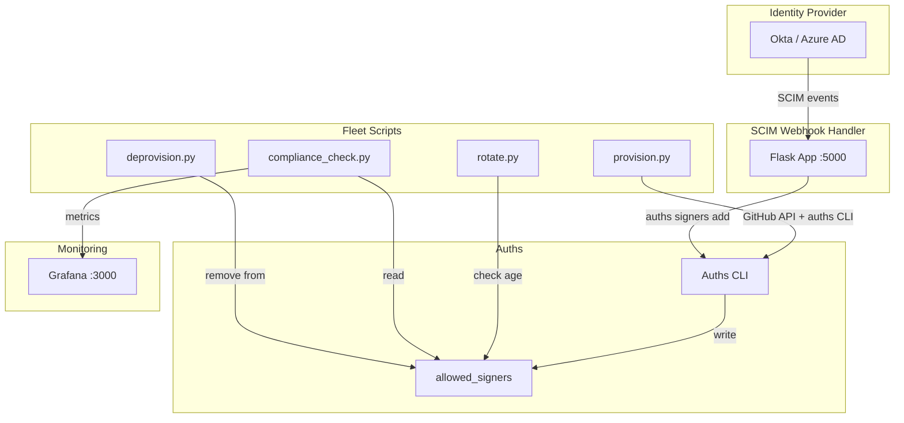

# Fleet Management with Auths

This example demonstrates how to manage developer signing identities at scale using [Auths](https://github.com/auths-dev/auths). It includes automated provisioning, compliance reporting, SCIM integration, and Grafana dashboards.

## Quick Start

```bash
# 1. Start the local demo stack (Grafana + SCIM webhook handler)
cp .env.example .env
docker compose up -d

# 2. Provision developers from a GitHub org
export GITHUB_TOKEN="ghp_your_token_here"
python fleet/sync_from_github_org.py --org your-org --output .auths/allowed_signers

# 3. View dashboards at http://localhost:3000 (admin/admin)
```

## What's Included

| Path | Purpose |
|------|---------|
| `fleet/provision.py` | Bulk-provision developer identities from GitHub org |
| `fleet/deprovision.py` | Revoke keys when developers leave |
| `fleet/rotate.py` | Enforce 90-day key rotation policy |
| `fleet/compliance_check.py` | Generate signing compliance report (JSON) |
| `fleet/audit_export.py` | Export audit trail to CSV/JSON |
| `fleet/sync_from_github_org.py` | Sync `allowed_signers` from GitHub org members |
| `policies/` | JSON policy definitions (signing required, rotation, key type) |
| `dashboards/grafana/` | Pre-built Grafana dashboards for fleet monitoring |
| `scim/webhook-handler/` | Flask-based SCIM webhook handler for IdP integration |
| `scim/okta-config.md` | Step-by-step Okta SCIM setup guide |
| `scim/azure-ad-config.md` | Step-by-step Azure AD SCIM setup guide |

## Architecture



## Prerequisites

- Docker and Docker Compose
- Python 3.11+
- [Auths CLI](https://github.com/auths-dev/auths) (`brew install auths-dev/auths-cli/auths`)
- GitHub personal access token (for org member sync)

## Fleet Scripts

All scripts use `argparse` for CLI arguments. Run any script with `--help` for usage:

```bash
python fleet/provision.py --help
python fleet/compliance_check.py --repo . --policy policies/signing_required.json
python fleet/rotate.py --signers .auths/allowed_signers --max-age 90
python fleet/audit_export.py --repo . --format json --output audit.json
```

## SCIM Integration

The webhook handler receives SCIM events from identity providers (Okta, Azure AD) and automatically provisions/deprovisions developer signing identities.

See setup guides:
- [Okta SCIM Setup](scim/okta-config.md)
- [Azure AD SCIM Setup](scim/azure-ad-config.md)

## Policies

Policy files in `policies/` define fleet-wide signing requirements:

| Policy | Description |
|--------|-------------|
| `signing_required.json` | All commits to protected branches must be signed |
| `rotation_90d.json` | Keys must be rotated every 90 days |
| `ed25519_only.json` | Only Ed25519 keys are allowed |

## Troubleshooting

**Docker Compose fails to start** — Ensure ports 3000 and 5000 are not in use. Check with `docker compose logs`.

**GitHub API rate limit** — Use a personal access token. Set `GITHUB_TOKEN` in `.env`.

**No data in Grafana** — Dashboards require compliance report data. Run `python fleet/compliance_check.py` to generate initial data.
